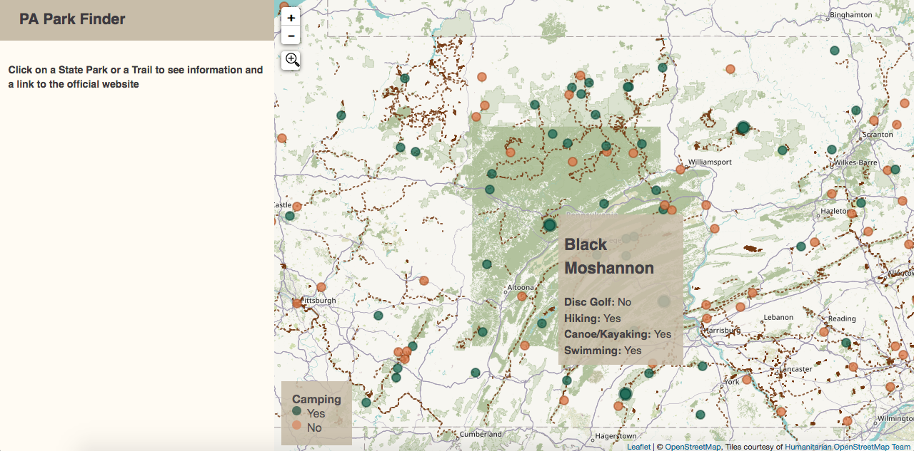
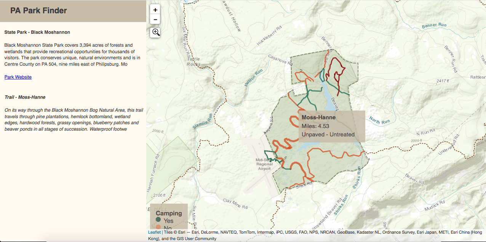

# Pennsylvania Park Finder
**An interactive web application, built using Leaflet, for finding state parks and hiking trails in Pennsylvania. Click [here](https://eneedham.github.io/park-finder/) to see it in action.**

*This project is still a work in progress, see below for future improvements*

### Project Inspiration
There are many hiking based applications out there like [AllTrails](https://www.alltrails.com/) and [Hiking Project](https://www.hikingproject.com/), but I've struggled to find a good method for finding state parks with camping and hiking. The PA state park website has improved recently and now features a [map of camping locations](https://www.dcnr.pa.gov/StateParks/CampingLocationsMap/Pages/default.aspx). However, its still tough to get a good grasp of the surrounding topography, hiking trails within each park, and longer connector trails that might be suited to backpacking. This application is a step towards creating a personal solution for more quickly finding outdoor adventures in PA. 

### Future Work & Issues to be Resolved
- transition data and map tiles to vector tiles, likely hosted on Mapbox. The application is currently loading all of the vector data and is quite slow
- create mobile version
- resolve incorrect coordinates being recorded for state park points, resulting in not zooming to center of park boundaries on click
- link park amenities and park boundaries so that park info will populate when the park boundary is clicked, rather than just the park amenities / points
- clear state park info when a trail outside of the state park is clicked on
- change "null" trail/park info to "no data" or "no information"
- build a more robust data pipeline for populating json's, or ultimately vector tiles, rather than just using pre-downloaded data.

### Application Screenshots
#### state-wide view

#### park view

